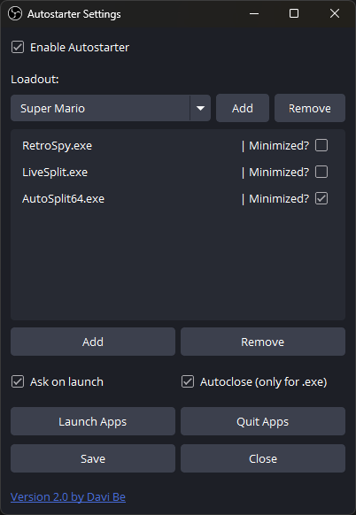
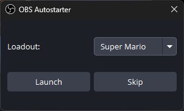
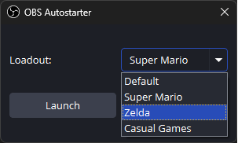

# OBS Autostarter

Plugin for OBS Studio that automatically launches and quits programs alongside OBS. Perfect for streamers and content creators who need to start multiple applications when beginning their streaming or recording sessions.


## Features

- 🚀 Automatically launch programs when OBS starts
- 🎯 Save multiple loadouts for different scenarios
- 📱 Launch multiple programs per loadout
- ⚙️ Highly configurable launch options:
  - 🔽 Launch programs minimized
  - 🔄 Automatic program termination when OBS exits
  - 💬 Optional launch confirmation dialog
- 🎮 Launch and quit programs directly from OBS
- 💻 Command line support (`--autostarter "loadoutname"`)

#### Settings



#### Launch Dialog

 


## Improvements over the old Lua Script

- ✨ Native C++ implementation for better performance
- 📦 Multiple loadout support
- 💬 Added launch confirmation option
- 🔧 More configuration options
- 🛠️ Full process management with proper termination
- 🔍 Prevents duplicate programm launches
- ⚡ Faster startup and response times
- 🖥️ Modern UI with better usability

## System Requirements

- Windows 10 or later
- OBS Studio 29.0.0 or later
- 64-bit system

## Installation

1. Download the latest release from the [releases page](https://github.com/DaviBe92/OBSAutostarter/releases)
2. Close OBS Studio if it's running
3. Extract the files to your OBS plugins directory:
   `C:\Program Files\obs-studio\obs-plugins\64bit`
4. Start OBS Studio
5. Find "Autostarter" in the Tools menu

## Usage

1. Open OBS Studio
2. Go to Tools → Autostarter
3. Create a new loadout or use the default one
4. Add your programs using the "Add" button
5. Configure launch options for each program
6. Save your settings

## Configuration

- **Loadouts**: Create multiple program groups for different scenarios
- **Launch Options**:
  - Minimize on start
  - Auto-close when OBS exits
  - Launch confirmation dialog
- **Command Line**: 
  Start OBS with a specific loadout using:
  ```
  obs64.exe --autostarter "loadoutname"
  ```
  This will bypass the enabled state and launch dialog, always launching the specified loadout.

## Support
- [Join Discord](https://discord.gg/VmrQQBpPSK)

## Credits

Developed with ❤️ by [Davi Be](https://github.com/DaviBe92)
